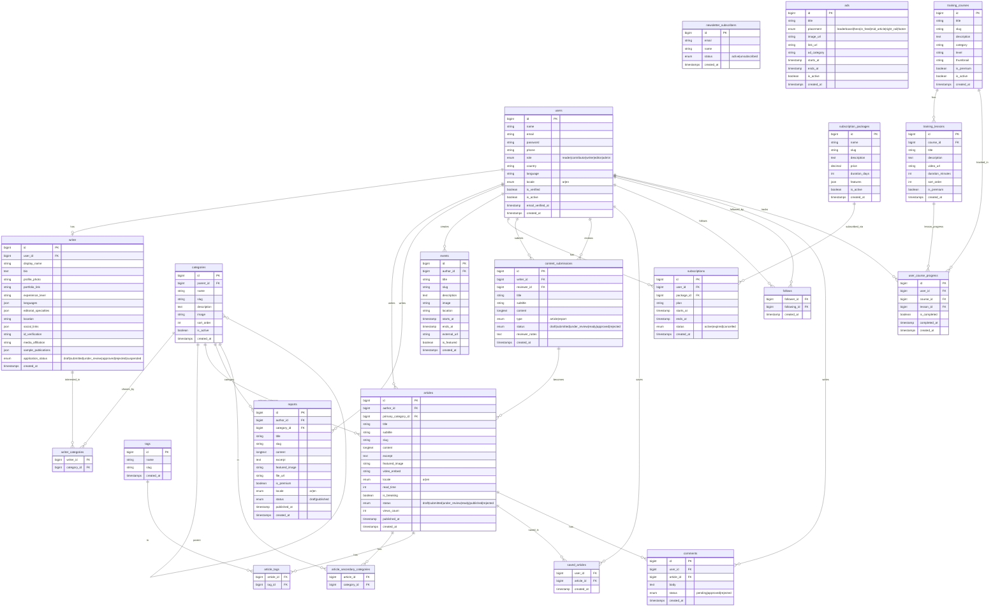

# Al Shaheen 360 — ERD

```mermaid
erDiagram
    users {
        bigint id PK
        string name
        string email
        string password
        string phone
        enum role "reader|contributor|writer|editor|admin"
        string country
        string language
        enum locale "ar|en"
        boolean is_verified
        boolean is_active
        timestamp email_verified_at
        timestamps created_at
    }

    writer {
        bigint id PK
        bigint user_id FK
        string display_name
        text bio
        string profile_photo
        string portfolio_link
        string experience_level
        json languages
        json editorial_specialties
        string location
        json social_links
        string id_verification
        string media_affiliation
        json sample_publications
        enum application_status "draft|submitted|under_review|approved|rejected|suspended"
        timestamps created_at
    }

    writer_categories {
        bigint writer_id FK
        bigint category_id FK
    }

    categories {
        bigint id PK
        bigint parent_id FK
        string name
        string slug
        text description
        string image
        int sort_order
        boolean is_active
        timestamps created_at
    }

    tags {
        bigint id PK
        string name
        string slug
        timestamps created_at
    }

    articles {
        bigint id PK
        bigint author_id FK
        bigint primary_category_id FK
        string title
        string subtitle
        string slug
        longtext content
        text excerpt
        string featured_image
        string video_embed
        enum locale "ar|en"
        int read_time
        boolean is_breaking
        enum status "draft|submitted|under_review|ready|published|rejected"
        int views_count
        timestamp published_at
        timestamps created_at
    }

    article_secondary_categories {
        bigint article_id FK
        bigint category_id FK
    }

    article_tags {
        bigint article_id FK
        bigint tag_id FK
    }

    comments {
        bigint id PK
        bigint user_id FK
        bigint article_id FK
        text body
        enum status "pending|approved|rejected"
        timestamps created_at
    }

    saved_articles {
        bigint user_id FK
        bigint article_id FK
        timestamp created_at
    }

    follows {
        bigint follower_id FK
        bigint following_id FK
        timestamp created_at
    }

    reports {
        bigint id PK
        bigint author_id FK
        bigint category_id FK
        string title
        string slug
        longtext content
        text excerpt
        string featured_image
        string file_url
        boolean is_premium
        enum locale "ar|en"
        enum status "draft|published"
        timestamp published_at
        timestamps created_at
    }

    events {
        bigint id PK
        bigint author_id FK
        string title
        string slug
        text description
        string image
        string location
        timestamp starts_at
        timestamp ends_at
        string external_url
        boolean is_featured
        timestamps created_at
    }

    newsletter_subscribers {
        bigint id PK
        string email
        string name
        enum status "active|unsubscribed"
        timestamps created_at
    }

    ads {
        bigint id PK
        string title
        enum placement "leaderboard|hero|in_feed|mid_article|right_rail|footer"
        string image_url
        string link_url
        string ad_category
        timestamp starts_at
        timestamp ends_at
        boolean is_active
        timestamps created_at
    }

    subscription_packages {
        bigint id PK
        string name
        string slug
        text description
        decimal price
        int duration_days
        json features
        boolean is_active
        timestamps created_at
    }

    subscriptions {
        bigint id PK
        bigint user_id FK
        bigint package_id FK
        string plan
        timestamp starts_at
        timestamp ends_at
        enum status "active|expired|cancelled"
        timestamps created_at
    }

    content_submissions {
        bigint id PK
        bigint writer_id FK
        bigint reviewer_id FK
        string title
        string subtitle
        longtext content
        enum type "article|report"
        enum status "draft|submitted|under_review|ready|approved|rejected"
        text reviewer_notes
        timestamps created_at
    }

    training_courses {
        bigint id PK
        string title
        string slug
        text description
        string category
        string level
        string thumbnail
        boolean is_premium
        boolean is_active
        timestamps created_at
    }

    training_lessons {
        bigint id PK
        bigint course_id FK
        string title
        text description
        string video_url
        int duration_minutes
        int sort_order
        boolean is_premium
        timestamps created_at
    }

    user_course_progress {
        bigint id PK
        bigint user_id FK
        bigint course_id FK
        bigint lesson_id FK
        boolean is_completed
        timestamp completed_at
        timestamps created_at
    }

    users ||--o| writer : "has"
    users ||--o{ articles : "writes"
    users ||--o{ reports : "writes"
    users ||--o{ events : "creates"
    users ||--o{ subscriptions : "has"
    users ||--o{ content_submissions : "submits"
    users ||--o{ content_submissions : "reviews"
    users ||--o{ saved_articles : "saves"
    users ||--o{ follows : "follows"
    users ||--o{ follows : "followed_by"
    users ||--o{ comments : "writes"

    writer ||--o{ writer_categories : "interested_in"
    categories ||--o{ writer_categories : "chosen_by"

    categories ||--o{ categories : "parent"
    categories ||--o{ articles : "primary_category"
    categories ||--o{ reports : "category"

    articles ||--o{ article_secondary_categories : "has"
    categories ||--o{ article_secondary_categories : "in"
    articles ||--o{ article_tags : "has"
    tags ||--o{ article_tags : "in"
    articles ||--o{ saved_articles : "saved_in"
    articles ||--o{ comments : "has"

    subscription_packages ||--o{ subscriptions : "subscribed_via"

    training_courses ||--o{ training_lessons : "has"
    users ||--o{ user_course_progress : "tracks"
    training_courses ||--o{ user_course_progress : "tracked_in"
    training_lessons ||--o{ user_course_progress : "lesson_progress"

    content_submissions ||--o{ articles : "becomes"
```
