# Al Shaheen 360 — ERD Updated

هذا الملف يمثل نسخة موسعة ومنظمة من الـ ERD لتغطية السيناريو الكامل للمنصة: newsroom, roles, editorial workflow, subscriptions, ads, training, reports, interviews, multimedia, comments, saves, follows, analytics, and settings.

```mermaid
erDiagram
    users {
        bigint id PK
        string name
        string email
        string password
        string country
        string language
        enum locale "ar|en"
        boolean is_verified
        boolean is_active
        timestamp email_verified_at
        timestamps created_at
        timestamps updated_at
    }

    writer {
        bigint id PK
        bigint user_id FK
        string display_name
        text bio
        string profile_photo
        string portfolio_link
        enum application_status "draft|submitted|under_review|approved|rejected|suspended"
        text reviewer_notes
        timestamps created_at
        timestamps updated_at
    }

    contributor_categories {
        bigint contributor_id FK
        bigint category_id FK
    }

    readers {
        bigint id PK
        bigint user_id FK
        timestamps created_at
        timestamps updated_at
    }

    contributors {
        bigint id PK
        bigint user_id FK
        text bio
        string profile_photo
        string portfolio_link
        timestamps created_at
        timestamps updated_at
    }

    contributor_profile_categories {
        bigint contributor_id FK
        bigint category_id FK
    }

    editors {
        bigint id PK
        bigint user_id FK
        timestamps created_at
        timestamps updated_at
    }

    admins {
        bigint id PK
        bigint user_id FK
        timestamps created_at
        timestamps updated_at
    }

    categories {
        bigint id PK
        bigint parent_id FK
        string name
        string slug
        text description
        string image
        int sort_order
        boolean is_top_level
        boolean is_active
        timestamps created_at
        timestamps updated_at
    }

    tags {
        bigint id PK
        string name
        string slug
        timestamps created_at
        timestamps updated_at
    }

    articles {
        bigint id PK
        bigint author_id FK
        bigint primary_category_id FK
        bigint approved_by FK
        string title
        string subtitle
        string slug
        longtext content
        text excerpt
        string featured_image
        string video_embed
        enum locale "ar|en"
        int read_time
        boolean is_breaking
        boolean is_premium
        enum status "draft|submitted|under_review|ready|scheduled|published|rejected|archived"
        int views_count
        string seo_title
        text seo_description
        timestamp submitted_at
        timestamp approved_at
        timestamp scheduled_at
        timestamp published_at
        timestamps created_at
        timestamps updated_at
    }

    article_secondary_categories {
        bigint article_id FK
        bigint category_id FK
    }

    article_tags {
        bigint article_id FK
        bigint tag_id FK
    }

    article_revisions {
        bigint id PK
        bigint article_id FK
        bigint user_id FK
        longtext content_snapshot
        text notes
        enum action "created|updated|submitted|reviewed|approved|rejected|published|archived"
        timestamps created_at
    }

    article_views {
        bigint id PK
        bigint article_id FK
        bigint user_id FK
        string ip_hash
        string user_agent
        string referrer
        timestamp viewed_at
    }

    comments {
        bigint id PK
        bigint user_id FK
        bigint article_id FK
        bigint parent_id FK
        text body
        enum status "pending|approved|rejected|spam"
        timestamps created_at
        timestamps updated_at
    }

    saved_articles {
        bigint user_id FK
        bigint article_id FK
        timestamp created_at
    }

    follows {
        bigint follower_id FK
        bigint writer_profile_id FK
        timestamp created_at
    }

    reports {
        bigint id PK
        bigint author_id FK
        bigint category_id FK
        string title
        string slug
        longtext content
        text excerpt
        string featured_image
        string file_url
        boolean is_premium
        enum locale "ar|en"
        enum status "draft|under_review|published|archived"
        int views_count
        timestamp published_at
        timestamps created_at
        timestamps updated_at
    }

    interviews {
        bigint id PK
        bigint author_id FK
        bigint category_id FK
        string guest_name
        string guest_title
        string guest_photo
        string title
        string slug
        longtext content
        text excerpt
        string featured_image
        string video_embed
        boolean is_premium
        enum locale "ar|en"
        enum status "draft|under_review|published|archived"
        int views_count
        timestamp published_at
        timestamps created_at
        timestamps updated_at
    }

    media_items {
        bigint id PK
        bigint author_id FK
        bigint category_id FK
        string title
        string slug
        text description
        enum type "video|audio|gallery"
        string media_url
        string thumbnail
        int duration_seconds
        text transcript
        boolean is_premium
        enum locale "ar|en"
        enum status "draft|published|archived"
        timestamp published_at
        timestamps created_at
        timestamps updated_at
    }

    events {
        bigint id PK
        bigint author_id FK
        string title
        string slug
        text description
        string image
        string location
        timestamp starts_at
        timestamp ends_at
        string external_url
        boolean is_featured
        timestamps created_at
        timestamps updated_at
    }

    newsletter_subscribers {
        bigint id PK
        bigint user_id FK
        string email
        string name
        enum status "active|unsubscribed"
        timestamp subscribed_at
        timestamp unsubscribed_at
        timestamps created_at
        timestamps updated_at
    }

    ads {
        bigint id PK
        string title
        enum placement "leaderboard|hero|in_feed|mid_article|right_rail|footer"
        string image_url
        string link_url
        string ad_category
        boolean is_native
        boolean is_active
        timestamp starts_at
        timestamp ends_at
        timestamps created_at
        timestamps updated_at
    }

    subscription_packages {
        bigint id PK
        string name
        string slug
        text description
        decimal price
        string currency
        int duration_days
        json features
        boolean ad_light
        boolean is_active
        timestamps created_at
        timestamps updated_at
    }

    subscriptions {
        bigint id PK
        bigint user_id FK
        bigint package_id FK
        string plan
        timestamp starts_at
        timestamp ends_at
        enum status "active|expired|cancelled|pending"
        timestamps created_at
        timestamps updated_at
    }

    payments {
        bigint id PK
        bigint user_id FK
        bigint subscription_id FK
        decimal amount
        string currency
        string provider
        string provider_reference
        enum status "pending|paid|failed|refunded"
        timestamp paid_at
        timestamps created_at
        timestamps updated_at
    }

    content_submissions {
        bigint id PK
        bigint contributor_id FK
        bigint reviewer_id FK
        bigint article_id FK
        string title
        string subtitle
        longtext content
        enum type "article|report|interview|media"
        enum status "draft|submitted|under_review|ready|approved|rejected"
        text reviewer_notes
        timestamp submitted_at
        timestamp reviewed_at
        timestamps created_at
        timestamps updated_at
    }

    training_courses {
        bigint id PK
        string title
        string slug
        text description
        string category
        string level
        string thumbnail
        boolean is_premium
        boolean is_active
        int sort_order
        timestamps created_at
        timestamps updated_at
    }

    training_lessons {
        bigint id PK
        bigint course_id FK
        string title
        text description
        string video_url
        int duration_minutes
        int sort_order
        boolean is_premium
        timestamps created_at
        timestamps updated_at
    }

    user_course_progress {
        bigint id PK
        bigint user_id FK
        bigint course_id FK
        bigint lesson_id FK
        boolean is_completed
        timestamp completed_at
        timestamps created_at
        timestamps updated_at
    }

    pages {
        bigint id PK
        string title
        string slug
        longtext content
        enum locale "ar|en"
        boolean is_active
        timestamps created_at
        timestamps updated_at
    }

    site_settings {
        bigint id PK
        string key
        json value
        timestamps created_at
        timestamps updated_at
    }

    users ||--o| readers : "reader_profile"
    users ||--o| contributors : "contributor_profile"
    users ||--o| writers : "writer_profile"
    users ||--o| editors : "editor_profile"
    users ||--o| admins : "admin_profile"
    users ||--o{ articles : "writes"
    users ||--o{ articles : "approves"
    users ||--o{ reports : "writes"
    users ||--o{ interviews : "writes"
    users ||--o{ media_items : "creates"
    users ||--o{ events : "creates"
    users ||--o{ subscriptions : "has"
    users ||--o{ payments : "pays"
    users ||--o{ content_submissions : "reviews"
    users ||--o{ saved_articles : "saves"
    users ||--o{ comments : "writes"
    users ||--o{ newsletter_subscribers : "subscribes"
    users ||--o{ user_course_progress : "tracks"

    writer ||--o{ contributor_categories : "interested_in"
    writer ||--o{ content_submissions : "submits"
    writer ||--o{ follows : "followed_by"
    contributors ||--o{ contributor_profile_categories : "interested_in"
    categories ||--o{ contributor_categories : "chosen_by_writer"
    categories ||--o{ contributor_profile_categories : "chosen_by_contributor"

    categories ||--o{ categories : "parent_child"
    categories ||--o{ articles : "primary_category"
    categories ||--o{ reports : "report_category"
    categories ||--o{ interviews : "interview_category"
    categories ||--o{ media_items : "media_category"

    articles ||--o{ article_secondary_categories : "has_secondary"
    categories ||--o{ article_secondary_categories : "secondary_for"
    articles ||--o{ article_tags : "has_tags"
    tags ||--o{ article_tags : "used_in"
    articles ||--o{ article_revisions : "has_revisions"
    users ||--o{ article_revisions : "performs_action"
    articles ||--o{ article_views : "has_views"
    users ||--o{ article_views : "views"
    articles ||--o{ saved_articles : "saved_in"
    articles ||--o{ comments : "has_comments"
    comments ||--o{ comments : "replies"

    users ||--o{ follows : "follows_writer"

    subscription_packages ||--o{ subscriptions : "subscribed_via"
    subscriptions ||--o{ payments : "has_payments"

    training_courses ||--o{ training_lessons : "has_lessons"
    training_courses ||--o{ user_course_progress : "tracked_course"
    training_lessons ||--o{ user_course_progress : "tracked_lesson"

    articles ||--o{ content_submissions : "originates_from"
```

---

## ملاحظات تنفيذ مهمة

1. **Class Table Inheritance**: جدول `users` يحمل البيانات المشتركة فقط (name, email, password, locale, country, language). كل role له جدول profile مستقل:
   - `readers`: مرتبط بـ user_id فقط
   - `contributors`: bio, profile_photo, portfolio_link + categories pivot
   - `writer`: display_name, bio, experience_level, languages, specialties, location, social_links, application_status
   - `editors`: مرتبط بـ user_id فقط
   - `admins`: مرتبط بـ user_id فقط
   - الدور يُحدَّد بوجود السجل في الجدول المقابل لا بعمود role على users.
2. تم إضافة `interviews` و `media_items` لأن الـ IA تحتوي Interviews و Multimedia.
3. تم إضافة `article_revisions` لأن الـ editorial workflow يحتاج سجل مراجعة وتعديلات.
4. تم إضافة `article_views` لدعم Trending و Most Read و Writer Analytics.
5. تم إضافة `payments` لأن الاشتراك يتضمن خطوة دفع.
6. تم إضافة `pages` و `site_settings` لإدارة About و Contact والإعدادات العامة.
7. تم توسيع حالات المقال لتشمل `ready`, `scheduled`, و `archived`.
8. تم إضافة `is_premium` و SEO fields للمحتوى العام القابل للنشر.
